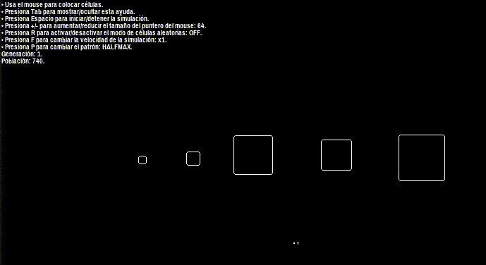
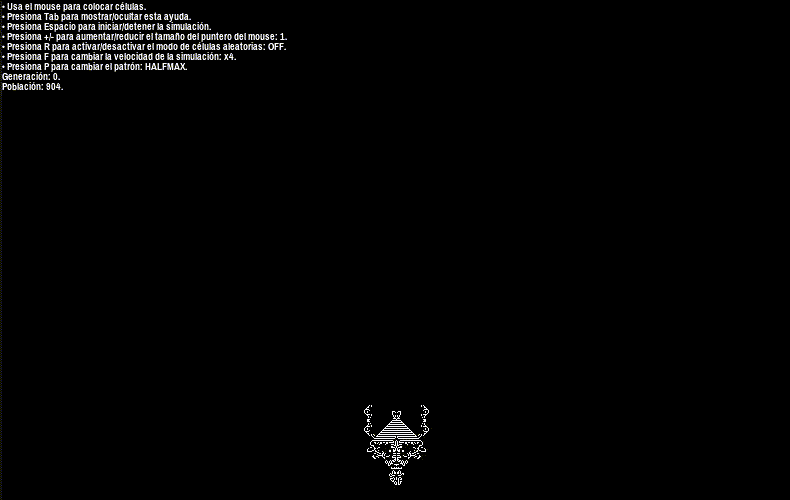

:octocat::octocat::octocat: Para leer la versión en español de este documento [haz click aquí](./LEEME.md). :octocat::octocat::octocat:
- - -
# monstrolife
*monstrolife* is a basic Allegro 5 implementation of Conway's Game of Life originally written for a 24 hour programming challenge.

 

 
- - -
## Features
* Interactive mode using the mouse.
* Preconfigured patterns (use the **P** key).
* Supports loading RLE patterns from the command line (use the **P** key to use the *Custom* pattern).

## Building
On **Linux**, the included `CMakeLists.txt` should build the project given that the necessary libraries are installed on your system.

* Make sure you have the required packages installed:
  * **CMake**
  * **Allegro 5** development files
* Create a *build* directory inside the project directory and build it using *CMake + make*:
```
monstruosoft@PC:~$ cd monstrolife
monstruosoft@PC:~/monstrolife$ mkdir build
monstruosoft@PC:~/monstrolife$ cd build
monstruosoft@PC:~/monstrolife/build$ cmake ..
monstruosoft@PC:~/monstrolife/build$ make
```

On **Windows**, you should be able to build the game using *CMake + MinGW*. Good luck with that, though, since I can't test the build process on Windows.

